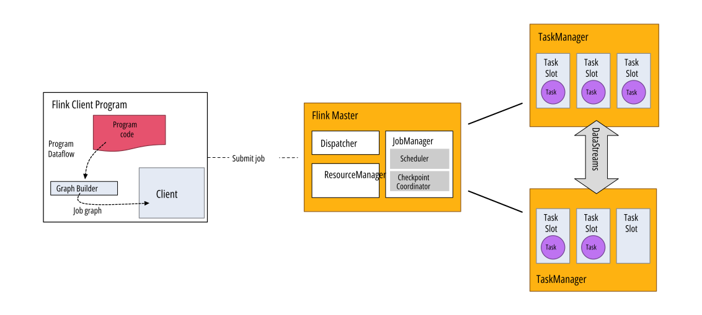
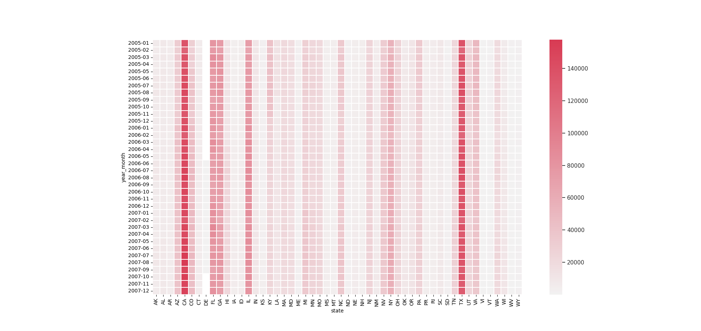
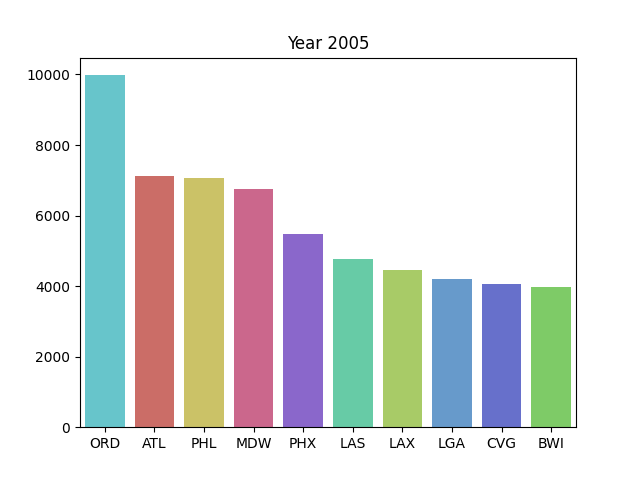

# Flink Experiment

This project is an experiment with Apache Flink, a framework for distributed stream and batch data processing. There are two main parts:

- `src/word_count`: a word count example using PyFlink
- `src/data_expo_queries`: list of four queries taken from the Data Expo 2009 dataset, using Apache Flink with Java

These two parts have been separated into two different folders after some difficulties with PyFlink. Apache Flink offers a lot of APIs for Python but there are still some limitations that make difficult to develop a project with it. So the queries of Data Expo 2009 dataset have been developed with Java, the most stable and supported API.

- [Flink Experiment](#flink-experiment)
- [Apache Flink](#apache-flink)
  - [Stream Processing](#stream-processing)
  - [DataStream API and Table API](#datastream-api-and-table-api)
  - [Windowing](#windowing)
  - [Flink Architecture](#flink-architecture)
  - [Execution environment](#execution-environment)
- [Set up a Flink cluster](#set-up-a-flink-cluster)
  - [Standalone cluster](#standalone-cluster)
  - [Docker cluster](#docker-cluster)
  - [Run a Flink job](#run-a-flink-job)
    - [Command line](#command-line)
      - [Using docker](#using-docker)
    - [Web interface](#web-interface)
- [Project structure](#project-structure)
  - [Setting up the environment](#setting-up-the-environment)
    - [Python with Conda](#python-with-conda)
    - [Java JDK](#java-jdk)
    - [Download datasets](#download-datasets)
- [Word Count](#word-count)
  - [Word Count DataStream API](#word-count-datastream-api)
  - [Word Count Table API](#word-count-table-api)
  - [Run and result](#run-and-result)
- [Data Expo 2009](#data-expo-2009)
  - [Dataset used columns](#dataset-used-columns)
  - [Set up the socket server](#set-up-the-socket-server)
  - [Environment and Socket](#environment-and-socket)
  - [Q1 - When is the best time of the week to fly to minimise delays ?](#q1---when-is-the-best-time-of-the-week-to-fly-to-minimise-delays--)
    - [Explanation](#explanation)
    - [Considerations](#considerations)
    - [Result](#result)
  - [Q2 - Do older planes suffer more delays?](#q2---do-older-planes-suffer-more-delays-)
    - [Explanation](#explanation-1)
    - [Considerations](#considerations-1)
    - [Result](#result-1)
  - [Q3 - How does the number of people flying between different locations change over time?](#q3---how-does-the-number-of-people-flying-between-different-locations-change-over-time-)
    - [Explanation](#explanation-2)
    - [Considerations](#considerations-2)
    - [Result](#result-2)
  - [Q4 - Can you detect cascading failures as delays in one airport create delays in others?](#q4---can-you-detect-cascading-failures-as-delays-in-one-airport-create-delays-in-others-)
    - [Explanation](#explanation-3)
    - [Considerations](#considerations-3)
    - [Result](#result-3)
- [Conclusion](#conclusion)

# Apache Flink

Apache Flink is an open-source stream processing framework that can be used for processing unbounded and bounded data streams. It is a distributed system that can run on a cluster of machines, and it provides efficient, scalable, and fault-tolerant stream and batch data processing. Flink is written in Java and Scala, and it has a rich set of APIs for creating streaming data pipelines.

## Stream Processing

In Flink, applications are composed of streaming dataflows that can be transformed using operators like `map`, `reduce`, `keyBy` etc. The dataflows form a directed acyclic graph (DAG) that start with one o more source and end with one or more sinks. The dataflows can be executed on a local machine or on a cluster of machines, and can be run in a streaming or batch fashion.

<p align="center">
    
</p>

As you can see in the example we can spot two type of operators:

- **one-to-one** operators, like `map` and `filter`, that transform one input element into one output element preserving partitioning and ordering.
- **redistributing** operators, like `keyBy` or `rebalance`, that transform one input element into zero, one or more output elements.

## DataStream API and Table API

In Flink there are two main programming interface for working with streams of data: **DataStream API** and **Table API**.

<p align="center">
    
</p>

The **DataStream API** is core API for working with streams of data. It allows to process streams in real-time and perform transformations using operators like `map`, `filter`, `join`, `aggregate` etc.

```Python
data_stream = ... # create a source data stream
data_stream\
    .map(lambda i: (i, 1)) \
    .key_by(lambda i: i[0]) \
    .reduce(lambda i, j: (i[0], (i[1] + j[1])))
```

The **Table API** instead is a programming interface for working with streams of data in a tabular format. It allows to express complex stream processing queries using a SQL-like syntax:

```Python
source_table = ... # create a source table
source_table\
    .group_by(col('word')) \
    .select(col('word'), lit(1).count.alias('count')) \
    .print()
```

DataStream API is more generic and allows more control over streams especially with custom functions, while the Table API is more expressive and easier to use. The Table API is built on top of the DataStream API, so it is possible to convert a Table into a DataStream and vice versa.

## Windowing

Flink has also the concept of windows, which allow you to process data over a fixed period of time, or you can define some custom function (like events count). There are four types of built-in windows:

- **Tumbling Window**: these windows are fixed-size, non-overlapping windows that are created based on a fixed time interval or number of events. For example, a tumbling window of 5 seconds the current window will be evaluated every 5 seconds and will contain the last 5 seconds of data.
- **Sliding Window**: similar to the tumbling window but these windows are also allowed to overlap. You can specify the size of the window and the interval at which the windows slide.
- **Session Window**: these windows group data into sessions based on the time that has passed since the last event. You can specify a maximum gap between events, and any events that fall within that gap will be placed in the same session.
- **Global Window**: a window that contains all the events in the stream.

<p align="center">
    
</p>

## Flink Architecture

Flink is a distributed system that can run on a cluster of machines. It is composed by three main components:

- **JobManager**: it is the master of the cluster and is responsible for the execution of the application. It receives job submissions from clients, and then it orchestrates the execution of the job by scheduling tasks on the available TaskManagers. The JobManager also maintains the global state of the Flink cluster, including the state of running and completed jobs.
- **TaskManager**: it is the worker node of the Flink cluster and is responsible for the execution of the tasks assigned to it by the JobManager. TaskManager has a fixed number of slots, and each slot can run one task at a time. The TaskManager also manages the local state of the tasks that are running on it, and it communicates with the JobManager to report the status of its tasks.
- **Client**: it is the client that submits the application to the cluster. It is responsible for the submission of the application to the cluster, the monitoring of the execution, etc.

<p align="center">
    
</p>

## Execution environment

The execution environment is the entry point for creating a Flink application, it is responsible for creating the data sources, sinks, and for executing the application. The execution environment is created by using the `StreamExecutionEnvironment` for DataStream API and `TableEnvironment` for Table API. Generally speaking, after defining the operation on the data source the application is executed by calling the `execute` method on the execution environment.

```Java
StreamExecutionEnvironment env = StreamExecutionEnvironment.getExecutionEnvironment();

DataStream<String> data_stream = ... # create a source data stream

// Init processing
data_stream.
    .name("source")
    .map(...).name("map1")
    .map(...).name("map2")
    .rebalance()
    .map(...).name("map3")
    .map(...).name("map4")
    .keyBy((value) -> value)
    .map(...).name("map5")
    .map(...).name("map6")
    .sinkTo(...).name("sink");

env.execute();
```

Operations that imply a 1-to-1 connection pattern between operation (like `map`, `flatMap`, `filter`) can just be chained together. Operations that imply a redistribution of the data (like `keyBy`, `rebalance`) will be executed in a separate task. Following the example above, the execution environment will create 3 tasks of the given Job:

- Task 1: `source`, `map1`, `map2`
- Task 2: `map3`, `map4`
- Task 3: `map5`, `map6`, `sink`

More graphically:

<p align="center">
    
</p>

# Set up a Flink cluster

A Flink cluster is composed by a JobManager and one or more TaskManagers. During the development is possible to run a Flink Job locally on a single machine where the JobManager and TaskManager are running in the same JVM. The JobManager will have a single task slot and all tasks of the Flink job will be executed on this single task slot. This is the default mode of execution when you run a Flink application from the IDE.

## Standalone cluster

Download the `1.16.0` version of Flink from the [official website](https://www.apache.org/dyn/closer.lua/flink/flink-1.16.0/flink-1.16.0-bin-scala_2.12.tgz) and unzip it. Then, go to the `bin` folder and run the following command to start a Flink cluster:

```bash
./start-cluster.sh
```

The cluster will be started on the local machine and it will be accessible at `localhost:8081`. There is a file where you can configure ports, hostnames, slots, and so on called `conf/flink-conf.yaml`.

The cluster can be stopped by running the following command also from the `bin` folder:

```bash
./stop-cluster.sh
```

## Docker cluster

The project includes a `docker-compose.yml` file that enables you to run a Flink cluster on Docker, making it easier to set up on any machine. The cluster consists of a JobManager and one TaskManager with five available slots. You can modify the `docker-compose.yml` file to adjust settings such as the number of slots and TaskManagers:

```yaml
version: "3.7"
services:
  flink-jobmanager:
    build:
      dockerfile: Dockerfile
    entrypoint: ["/docker-entrypoint.sh", "jobmanager"]
    container_name: flink-jobmanager
    ports:
      - "8081:8081"
    environment:
      - JOB_MANAGER_RPC_ADDRESS=flink-jobmanager
      - |
        FLINK_PROPERTIES=
          taskmanager.numberOfTaskSlots: 5
    extra_hosts:
      - "host.docker.internal:host-gateway"
    volumes:
      - ./src:/opt/flink/src
      - ./src/data_expo_queries/build/libs/:/opt/flink/data_expo_queries

  flink-taskmanager:
    build:
      dockerfile: Dockerfile
    entrypoint: ["/docker-entrypoint.sh", "taskmanager"]
    container_name: flink-taskmanager
    depends_on:
      - flink-jobmanager
    environment:
      - JOB_MANAGER_RPC_ADDRESS=flink-jobmanager
      - |
        FLINK_PROPERTIES=
          taskmanager.numberOfTaskSlots: 5
    extra_hosts:
      - "host.docker.internal:host-gateway"
    volumes:
      - ./src:/opt/flink/src
      - ./src/data_expo_queries/build/libs/:/opt/flink/data_expo_queries
```

To start the cluster, run the following command:

```bash
docker-compose build
docker-compose up
```

The cluster will be started on the local machine and it will be accessible at `localhost:8081`, like the standalone cluster. The cluster can be stopped by running the following command:

```bash
docker-compose down
```

It was somewhat challenging to build the Docker image, as I initially couldn't find a stable and supported image for PyFlink. In fact, the `Dockerfile` includes extra instructions for installing PyFlink on top of the Flink image ([flink:1.16.0-scala_2.12-java11](https://hub.docker.com/_/flink)).

## Run a Flink job

To run a Flink job on the cluster, you need to submit the application to the JobManager. The application can be submitted in two ways: Command line and Web Interface.

### Command line

You can submit the application by running the following command from the `bin` folder:

```bash
./flink run -c <main_class> <path_to_jar>
```

From default the `flink run` takes in input a jar file, but it is possible to pass a python file as well specifying the `--python` flag:

```bash
./flink run --python <path_to_python_file>
```

#### Using docker

If you are using the Docker cluster, you need to open a new terminal inside the <u>JobManager container</u> and run the command from there:

```bash
docker exec -it flink-jobmanager /bin/bash
# The command above will open a new terminal inside the JobManager container
flink run -c <main_class> <path_to_jar>
```

Another important note is that in the JobManager container there are two `volumes`:

```yaml
---
volumes:
  - ./src:/opt/flink/src
  - ./src/data_expo_queries/build/libs/:/opt/flink/data_expo_queries
```

So to reference a file that is inside the `src` folder, you need to use the path `/opt/flink/src/<path>` and for the Data Expo queries (later explained) the docker needs only the `build/libs/` folder that is located in `/opt/flink/data_expo_queries/<path>`.

### Web interface

You can submit the application by uploading the jar file from the web interface at `localhost:8081`. The web interface does not support the PyFlink API, so you will need to run the job from the command line if you are using PyFlink.

<p align="center">
    
</p>

For this project the output of the queries will be put in a file, located in the same directory of the jar file. After the load of the jar file, you can run the job by clicking on the `Submit`, but there is to specify the `EntryClass` that is different for each query (later explained).

# Project structure

Other than the two main parts of the project, there are some other folders:

- `src/datasets`: contains the datasets used in the project, in the citation section there are the links to download them
- `src/tools`: contains some utility functions used in the project, like `socket_with_pandas.py` that is used to create a socket server to send the Data Expo 2009 dataset to the Flink cluster
- `src/results/`: contains the result of the queries with also the Python script to make the plots

Flink works with Python 3.6, 3.7 and 3.8, so there is also a `environment.yml` file to create a `conda` environment with the right Python version explained in the next section.

## Setting up the environment

The version of Apache Flink used in this project is [1.16.0](https://nightlies.apache.org/flink/flink-docs-release-1.16/), the latest stable version at the moment of writing this document. The project has been developed in a Linux environment, but it should work in other OS as well.

### Python with Conda

The PyFlink API support only some version of Python, so getting the right version is important. I used Conda to create a virtual environment with the right Python version. To create the environment, run the following command:

```bash
conda env create -f environment.yml
```

Now a new environment called `flink-experiment` is created. To activate it, run the following command:

```bash
conda activate flink-experiment
```

We can now install the requirements to go on with the project:

```bash
pip install -r requirements.txt
```

### Java JDK

The Java API of Apache Flink is the most stable and supported, so it's the one used in the queries of the Data Expo 2009 dataset. To run the queries, we need to install the Java JDK. I have used the Azul Zulu Community version, but any other version should work, as long as it's Java 11.

```yaml
Version: 11
Vendor: Azul Zulu Community
```

Opening the project `src/data_expo_queries` in IntelliJ IDEA, we can see that the project is already configured to use the JDK installed in the system. If we want to use a different version, we can change it in the `Project Structure` of IntelliJ IDEA. The dependencies are managed with `Gradle`, so we don't need to install anything else. If there are some problems with `Gradle` there are some suggestions in the Flink documentation [here](https://nightlies.apache.org/flink/flink-docs-release-1.16/docs/dev/configuration/gradle/).

### Download datasets

The datasets used in the project are:

- [Data Expo 2009](https://community.amstat.org/jointscsg-section/dataexpo/dataexpo2009): `2005.csv`, `2006.csv`, `2007.csv`, `plane-data.csv` and `airports.csv`
- [QUOTE](https://www.kaggle.com/datasets/coolcoder22/quotes-dataset): `QUOTES.csv` the dataset used in the word count example.

After downloading the datasets, we need to move them to the `src/datasets` folder, it should look like this:

```bash
├── src
│   ├── datasets
│   │   ├── 2005.csv
│   │   ├── 2006.csv
│   │   ├── 2007.csv
│   │   ├── airports.csv
│   │   ├── plane-data.csv
│   │   └── QUOTE.csv
...
```

**Note**: the directory datasets is copied in the docker image, so if you want to use the Docker cluster you need download all the datasets and then build the image.

# Word Count

As a first example, we will implement a word count application. The job has been developed in Python using the PyFlink. The application reads a text file and counts the number of occurrences of each word of the file `QUOTES.csv` located in the `datasets` folder. The python files are:

- `src/word_count/word_count_datastream.py`
- `src/word_count/word_count_table.py`

The first application utilizes the `DataStream API`, while the second uses the `Table API`. Both applications are functionally the same, but the file `word_count_datastream.py` encountered an error with dependencies when run on the Docker and Standalone cluster, as detailed in the `error.txt` file. However, the application runs correctly on the local machine.

## Word Count DataStream API

```python
# File: word_count_datastream.py
d_env = StreamExecutionEnvironment.get_execution_environment()
...
ds = d_env.from_source(
    source_name="file_source",
    source=FileSource.for_record_stream_format(CsvReaderFormat.for_schema(csv_input_schema), input_path).build(),
    watermark_strategy=WatermarkStrategy.for_monotonous_timestamps()
    )
ds = ds.flat_map(split) \
    .map(lambda i: (i, 1)) \
    .key_by(lambda i: i[0]) \
    .reduce(lambda i, j: (i[0], (i[1] + j[1]))) \
    .map(lambda i: Row(word=i[0], count=i[1]),
         output_type=Types.ROW_NAMED(["word", "count"], [Types.STRING(), Types.INT()]))
# Write to csv file
csv_output_schema = CsvSchema.builder() \
    .add_string_column("word") \
    .add_number_column("count", number_type=DataTypes.INT()) \
    .build()
# Sink the result
ds \
    .rebalance() \
    .sink_to(FileSink.for_bulk_format(
        output_path,
        CsvBulkWriters.for_schema(csv_output_schema)).build()) \
    .set_parallelism(1)
```

The code above is the main part of the application, it reads the input file and then it splits the lines into words. The words are then mapped to a tuple with the word and the number 1, so we can count the occurrences of each word. The `key_by` function groups the words by the word itself, so we can count the occurrences of each word. The `reduce` function sums the occurrences of each word. Finally, the `map` function maps the tuple to a Row object, so we can use the built-in `CsvBulkWriters` to write the output to a file.

## Word Count Table API

Looking at core code of the application it will look similar to a SQL query:

```python
# File: word_count_table.py
t_env = TableEnvironment.create(EnvironmentSettings.in_batch_mode())
# Create source table
source_table = create_source_table(t_env, 'source', file_path)
# Executing the word count
source_table.flat_map(split).alias('word') \
    .group_by(col('word')) \
    .select(col('word'), lit(1).count.alias('count')) \
    .to_pandas().to_csv(os.path.join(current_dir, file_output), index=False, header=False)
```

The code above creates a `TableEnvironment` in batch mode and sets up a `source_table` using the `create_source_table` function. The `flat_map` operation is applied to the `source_table` to split each row into a list of words. The resulting rows are grouped by the word with the `group_by` operation, and the number of occurrences of each word is counted with the `select` operation. The resulting table is then converted to a pandas dataframe using the `to_pandas` operation and saved to a csv file using `to_csv`.

## Run and result

To run the files in the local machine, we can use the following command from the root of the project:

```bash
cd src/word_count
python word_count_table.py  # or word_count_datastream.py
```

The output of the application will create an `output` folder with the file `world_count.csv` that contains the result of the word count. The ordered output should look like this:

```csv
word,count
the,39252
to,28566
i,26453
and,24728
a,24583
of,22001
is,16682
in,14827
that,13026
you,11577
```

The development of those applications was difficult, and after trying to fix the dependency error, I decided to switch from Python to Java for future tasks. Upon comparing the performance of the two APIs in local mode, the Table API proved to be significantly faster than the DataStream API, as shown by the following timings:

```bash
# DataStream API
time ~ 6m15s
# Table API
time ~ 0m10s
```

Given that the dataset is in tabular format and being processed in batch mode, the Table API is the most suitable choice due to its optimization for this type of computations.

# Data Expo 2009

The second part of the project utilizes a dataset from the Data Expo 2009 challenge organized by [Amstat](https://www.amstat.org/), which contains flight arrivals and departure informations for commercial flights from 1987 to 2008. For simplicity, only the data from the last three years of the dataset (2005, 2006, and 2007) is being used, which is stored in the files `2005.csv`, `2006.csv`, and `2007.csv`. The dataset is quite large, with a size of 12 gigabytes when uncompressed, and contains 29 columns of data related to flights, including departure and arrival times, and other information. The American Statistical Association (ASA) has challenged researchers to provide a graphical summary of the data for a set of given queries using this dataset.

The queries that we will be answering are the following:

- **Q1**: When is the best time of the week to fly to minimise delays ?
  - `EntryClass`: **org.data.expo.BestDayOfWeek**
- **Q2**: Do older planes suffer more delays?
  - `EntryClass`: **org.data.expo.PlansSufferDelay**
- **Q3**: How does the number of people flying between different locations change over time?
  - `EntryClass`: **org.data.expo.PeopleFlyingBetweenLocations**
- **Q4**: Can you detect cascading failures as delays in one airport create delays in others? Are there critical links in the system?
  - `EntryClass`: **org.data.expo.CascadingDelays**

## Dataset used columns

Not all the columns of the dataset are relevant for the queries, so we will only use the following columns:

- `Year`: The year of the flight
- `Month`: The month of the flight
- `DayofMonth`: The day of the month of the flight
- `DayOfWeek`: The day of the week of the flight (1 = Monday, 2 = Tuesday, etc.)
- `DepTime`: Actual departure time (%H%M format)
- `TailNum`: Unique tail number to identify the plane (also used to join with plane-data.csv)
- `ActualElapsedTime`: Difference between ArrTime and DepTime in minutes
- `CRSElapsedTime`: Difference between CRSArrTime and CRSDepTime in minutes (where CRS stands for "scheduled")
- `Origin`: Unique IATA airport code that flight was departed from, can be identified in airports.csv
- `Dest`: Unique IATA airport code for flight destination, can be identified in airports.csv

To answer the queries, we will need to join the dataset with the `plane-data.csv` and `airports.csv` files, which contain information about the planes and the airports, respectively. From the two join operations, we will only use the following columns:

- `plane-data.csv`:
  - `tailnum`: Unique tail number to identify the planes in plane-data.csv
  - `year`: Year of manufacture
- `airports.csv`:
  - `iata`: Unique IATA airport code
  - `state`: State of the airport

You can find more information about the columns in the dataset in the [Harvard metadata](https://dataverse.harvard.edu/dataset.xhtml?persistentId=doi:10.7910/DVN/HG7NV7).

## Set up the socket server

The purpose of this project is to explore the use of Apache Flink for data streaming. To do this, we will be using the DataStream API to process the data. The dataset files can be found in the `src/datasets` folder, and we can use the Python script `src/tools/socket_with_pandas.py` to create a socket server that will send the data to the Flink cluster. This script also utilizes the pandas library to read the CSV files, perform a join, and perform ETL (Extract, Transform, Load) operations to convert the data into a more suitable format for the Flink cluster. By default, the script will listen on port 8888 and, after the first connection, will send all the data through the socket in chunks of 2000000 rows (this means that it will take just four iterations to send an entire file). The script can be run with the following command:

```bash
cd src/tools
python socket_with_pandas.py
```

Or defining custom parameters:

```bash
python socket_with_pandas.py --port 8000 --chunk_size 5000 -f "../datasets/2005.csv" "../datasets/2006.csv"
```

## Environment and Socket

For every query, we first set up the environment by creating a `StreamExecutionEnvironment` and a DataStream from a socket server. The `DEBUG` attribute determines whether the application will run in debug mode or not. If it's in debug mode, the application will use a local environment and the stream will be created using a list of strings rather than coming from the socket server (see `DataExpoMethods` and `DataExpoDebug`).

Then there is a cast operation that converts the data from the socket into a `DataExpoRow` object, which is a class that contains the data of the flight:

```java
DataStream<String> data_stream = ...; // from socket server or list of strings

data_stream
  .assignTimestampsAndWatermarks(
    WatermarkStrategy.<String>forBoundedOutOfOrderness(Duration.ofSeconds(2))
      .withTimestampAssigner((event, timestamp) -> Instant.now().toEpochMilli()))
  .flatMap(
    (FlatMapFunction<String, DataExpoRow>)
      (value, out) -> {
        out.collect(new DataExpoRow(value));
      },
    Types.POJO(DataExpoRow.class));
```

The DataStream object, `data_stream`, is created either from the socket server or from a list of strings. The `assignTimestampsAndWatermarks` function assigns a timestamp to each event in the stream (as defined above the events are divided in groups of 2 seconds with the same timestamp). The `flatMap` operation converts the data from the stream into `DataExpoRow` objects, which are specified as the output type using `Types.POJO(DataExpoRow.class)` (where `POJO` is a built-in type for the custom classes as our case).

**Note**:

- Before running the application in the Flink cluster, we need to set `DEBUG=false` in each class that we want to execute, otherwise the application will run in debug mode and will use a local environment.
- The application must be build using `gradle build` and the jar file will be created in the `build/libs` folder.
- The `EntryClass` is different for each query
- If you want to run the application in the Docker cluster you need to change the host of the socket server from `localhost` to `host.docker.internal` (method `DataExpoMethods.get_data_stream`) otherwise the application will not be able to connect to the socket server.

## Q1 - When is the best time of the week to fly to minimise delays ?

**Idea**: we have to compute the delay for each flight, which is the difference between the actual elapsed time and the scheduled elapsed time. Then we have to group the flights by day of the week and compute the average delay for each day.

```java
// File: org.data.expo.BestDayOfWeek
data_stream.map(
    (MapFunction<DataExpoRow, Tuple3<Integer, Integer, Integer>>)
        (value) -> {
          // 0: day of week
          // 1: delay calculation
          // 2: counter of occurrences
          return new Tuple3<>(
              value.day_of_week, value.actual_elapsed_time - value.crs_elapsed_time, 1);
        },
    Types.TUPLE(Types.INT, Types.INT, Types.INT)); // Assign partitions by day of week
// Setting up the window calculation
DataStream<Tuple3<Integer, Integer, Integer>> result =
    data_stream_clean
        .keyBy(value -> value.f0)
        .window(TumblingEventTimeWindows.of(Time.seconds(process_time)))
        .reduce(
            (ReduceFunction<Tuple3<Integer, Integer, Integer>>)
                (i, j) -> new Tuple3<>(i.f0, i.f1 + j.f1, i.f2 + j.f2));
// Creating the sink of output file
final FileSink<Tuple3<Integer, Integer, Integer>> sink =
    FileSink.forRowFormat(
      new Path("output"),
      (Encoder<Tuple3<Integer, Integer, Integer>>)
          (element, stream) ->
              stream.write(
                  (String.format(
                          "%d,%.2f\n", element.f0, ((double) element.f1 / element.f2))
                      .getBytes())))
  .withRollingPolicy(OnCheckpointRollingPolicy.build())
  .build();
// Writing the result, the parallelism is 1 to avoid multiple files
result.rebalance().sinkTo(sink).setParallelism(1);
env.execute("Q1");
```

### Explanation

1. The `data_stream` is transformed into a new stream by applying a `map` function to each element. The function extracts three fields: the day of the week, the difference between the actual elapsed time and the scheduled elapsed time, and a counter set to 1.
2. The stream is partitioned by day of the week using the `keyBy` function.
3. The stream is windowed using the window function with a tumbling event-time window of the specified `process_time` in seconds. To see the final result, the window time must be set larger than the entire stream communication time, otherwise a partial result will be calculated (in the code set `SHOW_RESULT=true` to set a large window).
4. The `reduce` function is applied to the windowed stream, which combines the elements in each window by adding their second and third fields (the elapsed time difference and the counter) and creating a new tuple with the result.
5. A sink is created using the `FileSink` class to output the tuples to a file. The sink is set up to roll over on checkpoints. With this policy, the sink will roll over to a new file on every checkpoint, which is the default behavior. In our case the checkpoint is defined by the window time.
6. The stream is written to the sink using the `sinkTo` function, and the parallelism is set to 1 to avoid creating multiple files. On this phase the calculation is executed by dividing the elapsed time difference by the counter to get the average delay for each day of the week. The `rebalance` is called to make sure that the sink is executed by a single task.

### Considerations

The window time must be set to a duration longer than the entire stream communication time, otherwise the output will be a partial result. If the window time is set to a duration shorter than the communication time, the application will generate a result for each window and output it to the sink. Each partial result will be a tuple containing the average delay for each day of the week. The final result can be still computed from the partial result by grouping them by day of week and averaging the result.

### Result

My result is stored in `results/q1.csv` and it looks like this:

```csv
day,avg_delay
6,-5.26
4,-2.88
7,-4.24
3,-3.43
1,-3.65
5,-3.25
2,-3.77
```

The first column is the day of the week, and the second column is the average delay for that day. As we can see, the best day to fly is Thursday, while the worst day is Saturday.

<p align="center">
  
</p>

## Q2 - Do older planes suffer more delays?

> Here are the approximate ages for an aircraft:

- Old aircraft = 20+ years.
- Standard aircraft = 10-20 years.
- New aircraft = 10 years or less.

**Idea**: an old plane is a plane that is older than 20 years. So, we have to compute the delay for each flight, which is the difference between the actual elapsed time and the scheduled elapsed time. Then we have to group the flights by the age of the plane (old or new) and compute the average delay for each age.

```java
// File: org.data.expo.PlansSufferDelay
SingleOutputStreamOperator<Tuple3<String, Integer, Integer>> data_stream_clean = data_stream.
map(
    (value) -> {
      // 0: plane age
      // 1: delay calculation
      // 2: counter of occurrences
      return new Tuple3<>(
          value.year - value.year_of_plane > 20 ? "Old" : "New",
          value.actual_elapsed_time - value.crs_elapsed_time,
          1);
    },
    Types.TUPLE(Types.STRING, Types.INT, Types.INT));
// Setting up the window calculation
DataStream<Tuple3<String, Integer, Integer>> result =
data_stream_clean
.keyBy(value -> value.f0)
.window(TumblingEventTimeWindows.of(Time.seconds(process_time)))
.reduce((i, j) -> new Tuple3<>(i.f0, i.f1 + j.f1, i.f2 + j.f2));

final FileSink<Tuple3<String, Integer, Integer>> sink =
FileSink.forRowFormat(
    new Path("output"),
    (Encoder<Tuple3<String, Integer, Integer>>)
        (element, stream) ->
            stream.write(
                (String.format(
                        "%s,%.2f\n", element.f0, (double) element.f1 / element.f2)
                    .getBytes())))
.withRollingPolicy(OnCheckpointRollingPolicy.build())
.build();
// Writing the result, the parallelism is 1 to avoid multiple files
result.rebalance().sinkTo(sink).setParallelism(1);
env.execute("Q2");
```

### Explanation

The execution is very similar to the previous query:

1. The `data_stream` is transformed by applying a map function to each element. The function extracts three fields: if the plane is "Old" or "New" by calculating the difference between the date of the flight and the plane manufacture, the difference between the actual elapsed time and the scheduled elapsed time, and a counter set to 1.
2. The stream is partitioned by plane age using the `keyBy` function.
3. The stream is windowed using the window function with a tumbling event-time window of the specified process time in seconds (same as the previous query).
4. The `reduce` function is applied to the windowed stream, which combines the elements in each window by adding their second and third fields (the elapsed time difference and the counter) and creating a new tuple with the result.
5. A sink is created using the `FileSink` class to output the tuples to a file.
6. The stream is output to the sink using the `sinkTo` function, on this phase the calculation is executed by dividing the elapsed time difference by the counter to get the average delay for each plane age.

### Considerations

With a small window the application will generate partial results for each window. Each partial result is a tuple in the form `(age, avg_delay_window)`, which can be merged to obtain the final result by grouping the tuples by age and computing the average delay.

### Result

My result is stored in `results/q2.csv` and it looks like this:

```csv
age,avg_delay
Old,-1.23
New,-2.21
```

As we can see, the average delay is lower for the new planes, but the difference is not significant.

## Q3 - How does the number of people flying between different locations change over time?

There are multiple airports located in various cities, so one approach to group them by states rather than individual cities. Then we have to define the impact of people flying, and in our case we will count the number of incoming and outgoing flights for each state on a monthly basis.

**Idea**: to determine the number of incoming and outgoing flights for each state, we will create a tuple for the origin and destination of each flight, and then group these tuples by state, year, and month. This will allow us to calculate the total number of incoming and outgoing flights for each state monthly.

```java
// File: org.data.expo.PeopleFlyingBetweenLocations
SingleOutputStreamOperator<Tuple3<String, String, Integer>> data_stream_clean =
    data_stream.
      map(
        (v) ->
            new Tuple3<>(
                // Origin YYYY-MM State
                String.format("%d-%d %s", v.year, v.month, v.origin_state_airport),
                // Destination YYYY-MM State
                String.format("%d-%d %s", v.year, v.month, v.dest_state_airport),
                // Counter
                1),
        Types.TUPLE(Types.STRING, Types.STRING, Types.INT));
// Calculation flight by origin
DataStream<Tuple2<String, Integer>> result_by_origin =
    data_stream_clean
        .keyBy(value -> value.f0)
        .window(TumblingEventTimeWindows.of(Time.seconds(2)))
        .reduce((v1, v2) -> new Tuple3<>(v1.f0, "", v1.f2 + v2.f2))
        .map((v) -> new Tuple2<>(v.f0, v.f2), Types.TUPLE(Types.STRING, Types.INT));
// Calculation flight by destination
DataStream<Tuple2<String, Integer>> result_by_destination =
    data_stream_clean
        .keyBy(value -> value.f1)
        .window(TumblingEventTimeWindows.of(Time.seconds(2)))
        .reduce((v1, v2) -> new Tuple3<>("", v1.f1, v1.f2 + v2.f2))
        .map((v) -> new Tuple2<>(v.f1, v.f2), Types.TUPLE(Types.STRING, Types.INT));
// Merge the two streams and sink the result
final FileSink<Tuple2<String, Integer>> sink = ...; // Sink definition omitted for brevity
result_by_origin
    .union(result_by_destination)
    .keyBy(value -> value.f0)
    .window(TumblingEventTimeWindows.of(Time.seconds(process_time)))
    .sum(1)
    .sinkTo(sink)
    .setParallelism(1);
```

### Explanation

1. The `data_stream` is transformed by applying a map function to each element. The function extracts three fields: the origin with the year and month of the flight and the state of the airport, the destination with the year and month of the flight and the state of the airport, and a counter set to 1.
2. Now two streams are created, one for the origin and one for the destination. Each stream is partitioned by the origin or destination using the `keyBy `function and a window of two seconds is applied to each stream. The size of the window in this case can be arbitrary since there is a final window that will aggregate the results of the two streams.
3. The two streams are merged using the `union` function and then partitioned by the origin or destination using the `keyBy` function. To avoid partial result the window size must be larger than the entire stream communication.

### Considerations

The window size for grouping elements by origin and destination can be set to any value, but it must be large enough to cover the entire stream. If the window is not large enough, the partial results (i.e. tuples of the form (state, year, month, count)) will need to be grouped by state, year, and month and the counts will need to be summed to get the final result.

### Result

My result is stored in `results/q3.csv` and it looks like this:

```csv
year,month,state,flights
2007,12,OR,12981
2007,12,TX,129783
2007,12,RI,4010
2007,12,WI,10635
2007,11,PA,26979
2007,11,NV,35002
2007,10,TX,134471
2007,9,SD,1794
2007,9,NV,34956
...
```

Plotting the result in a heatmap we can see something like this:

<p align="center">
  
</p>

The x-axis represents the state and the y-axis represents the year and month. The color of each cell indicates the number of flights. The states of California (**CA**) and Texas (**TX**) appear to have a higher number of flights, while Delaware (**DE**) appears to have no flights in certain months. To improve the clarity of the data, I have normalized each column by its maximum value, as shown below:

<p align="center">
  
</p>
This result is significantly different from the previous one and provides more useful information. For instance, we can see that February has a higher number of flights compared to other months, and that there is a drastic increase in the number of flights in Kentucky (**KY**) from December 2005.

## Q4 - Can you detect cascading failures as delays in one airport create delays in others?

> The United States Federal Aviation Administration (FAA) considers a flight to be delayed when it is 15 minutes later than its scheduled time.

If a plane experiences a delay at one airport, we will assume that it will also experience a delay at its destination airport (since the destination of the initial flight must be the origin of the second flight) due to cascading failures.

**Idea**: get all flights with a delay greater or equal to 15 minutes then group by plane and day of flight. If the result contains more than one flight and the flights are consecutive (the first flight destination is the second flight origin) then we have a cascading failure.

```java
// File: org.data.expo.CascadingDelays
SingleOutputStreamOperator<FlightWithDelay> data_stream_clean =
    data_stream.data.filter(
                value ->
                    !value.tail_num.equals("000000") & !value.tail_num.equals("0")
                        && value.actual_elapsed_time - value.crs_elapsed_time < 0)
            .map(
                value ->
                    new FlightWithDelay(
                        value.tail_num,
                        new Tuple4<>(value.year, value.month, value.day_of_month, value.dep_time),
                        value.origin,
                        value.dest,
                        value.actual_elapsed_time - value.crs_elapsed_time));
// Union of the stream to merge the cascading delays
DataStream<FlightDelayAccumulator> result =
    data_stream_clean
        .keyBy(value -> value.plane)
        .window(TumblingEventTimeWindows.of(Time.seconds(2)))
        .aggregate(
            new AggregateFunction<
                FlightWithDelay, FlightDelayAccumulator, FlightDelayAccumulator>() {
              @Override
              public FlightDelayAccumulator createAccumulator() {
                // Init can be avoid here since we don't have enough information
                return null;
              }

              @Override
              public FlightDelayAccumulator add(
                  FlightWithDelay value, FlightDelayAccumulator accumulator) {
                if (accumulator == null) {
                  return new FlightDelayAccumulator(value);
                }
                accumulator.add_flight(value);
                return accumulator;
              }

              @Override
              public FlightDelayAccumulator getResult(FlightDelayAccumulator accumulator) {
                return accumulator;
              }

              @Override
              public FlightDelayAccumulator merge(
                  FlightDelayAccumulator a, FlightDelayAccumulator b) {
                if (a == null && b == null) {
                  return null;
                }
                if (a == null) {
                  return b;
                }
                if (b == null) {
                  return a;
                }
                for (FlightWithDelay f : b.get_all_flights()) {
                  a.add_flight(f);
                }
                return a;
              }
            })
            .filter(FlightDelayAccumulator::has_cascading_delays);;
final FileSink<FlightDelayAccumulator> sink = ...; // Sink definition omitted for brevity
// Writing the result, the parallelism is 1 to avoid multiple files
result.rebalance().sinkTo(sink).setParallelism(1);
```

### Explanation

1. The `data_stream` is filtered to remove the flights with a tail number equal to 0 or 000000 and the flights with a delay (15 minutes). The remaining flights are mapped to a new data type `FlightWithDelay` that contains the tail number, the date and time of the flight, the origin and destination airports, and the delay.
2. The stream is partitioned with `keyBy` by the tail number of the plane with a window of two seconds.
3. The window is aggregated using the `aggregate` function. The accumulator is a `FlightDelayAccumulator` that can be seen as a map/dictionary for each tail number. The map/dictionary consists of a sorted list of flights (ordered by the time of departure) keyed by the day of the flight. So each new flight is added to the list of flights of the corresponding day. The accumulator is initialized with the first flight of the window that has a new tail number not already defined. At the end of the window computation, the result will contain an accumulator for each tail number that includes all the flights of the plane that are in the window, grouped by day and sorted by time of departure.
4. Then the accumulator is filtered to keep only the flights that have a cascading delay. The filter is applied using the `has_cascading_delays` function. This function checks if in each day there is more than one flight and if the chain of flights is well-formed (the origin of the second flight is the destination of the first flight and so on) otherwise the chain is discarded.
5. The result is written to a csv file using the `sinkTo` function.

### Considerations

The size of the window can be arbitrarily decided, but it is to be taken into account that some cascading delays may not be found because flights on the same day are divided into two different windows. A solution can be to make the stream more intelligent by sending the data divided by day. Another consideration is that cascading delays that occur across two consecutive days may not be detected. To address this issue, it may be necessary to remove the `has_cascading_delays` filter and create a new window that includes flights from two consecutive days. This can be achieved by defining a custom window function, rather than processing the data by time.

### Result

The result is a csv file with the following format:

```
tail_num,year,month,day_of_month,result
N327UA,2005,1,12,GEG ORD -17 ORD RIC -17
N325UA,2005,1,9,BUF ORD -16 ORD MHT -27
N325UA,2005,1,28,LGA ORD -20 ORD LGA -20 LGA ORD -27
N102UW,2005,1,8,LAX PHL -22 PHL DCA -17
N446UA,2005,1,8,LAS DEN -21 DEN MCO -21
N301UA,2005,1,19,EWR ORD -17 ORD DFW -25
N187UW,2005,1,3,LAX CLT -16 CLT PHL -16
N928UA,2005,1,10,SFO SLC -18 SLC ORD -16 ORD EWR -18
```

Where the result is a string formed by triplets of the form `origin destination delay`. The file is not easy to read being also large in size, but it is possible to do some analysis such as:

> "Which airports have the most flight delay problems?”

<p align="center">
  
  
  
</p>

Where in the x-axis there is the airport and in the y-axis the number of cascading delays.

# Conclusion

This project was both interesting and challenging. Apache Flink is a great framework to work with, but in my view it is not yet as widely used as some other frameworks, which can make development take longer. While the results of the queries we ran could be improved, I had to set some limits on certain aspects in order to keep the project on track without unnecessarily complicating the code. The documentation for Apache Flink is extensive, but it can be hard to locate specific information without thoroughly reading through it. Additionally, the integration with Python appears to still be in a somewhat early stage. Despite these challenges, I found Flink to be a powerful tool for stream processing and would recommend it to others looking for a scalable solution.
