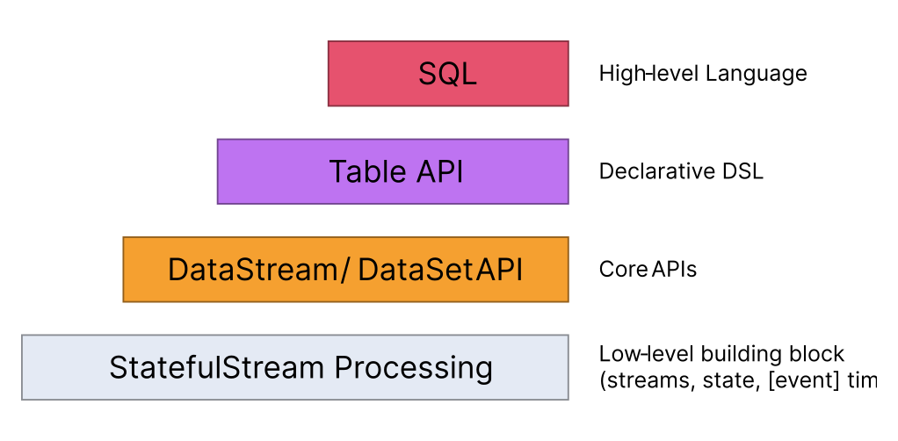

# Flink-experiment
This project is an experiment with Apache Flink, a framework for distributed stream and batch data processing. There are two main parts:
- `src/word_count`: a word count example using PyFlink
- `src/data_expo_queries`: list of four queries taken from the Data Expo 2009 dataset, using Apache Flink with Java

Those two parts have been separated in two different folders after some difficulties with PyFlink. Apache Flink offers a lot of APIs for Python but there are still some limitations that make difficult to develop a project with it. So the queries of Data Expo 2009 dataset have been developed with Java, the most stable and supported API.

[TOC]

## Apache Flink
Apache Flink is an open-source stream processing framework that can be used for processing unbounded and bounded data streams. It is a distributed system that can run on a cluster of machines, and it provides efficient, scalable, and fault-tolerant stream and batch data processing. Flink is written in Java and Scala, and it has a rich set of APIs for creating streaming data pipelines.

### Stream Processing
In Flink applications are composed of streaming dataflows that can be transformed using operators like `map`, `reduce`, `keyBy` etc. The dataflows form a directed acyclic graph (DAG) that start with one o more source and end with one or more sinks. The dataflows can be executed on a local machine or on a cluster of machines, and can be executed in a streaming or batch fashion.
<p align="center">
    
</p>

As you can see in the example we can spot two type of operators:
- `one-to-one` operators, like `map` and `filter`, that transform one input element into one output element preserving partitioning and ordering.
- `redistributing` operators, like `keyBy` or `rebalance`, that transform one input element into zero, one or more output elements

### Datastream API and Table API
In Flink there are two main programming interface for working with streams of data: `DataStream API` and `Table API`.

<p align="center">
    
</p>

The DataStream API is core API for working with streams of data. It allows to process streams in real-time and perform transformations using operators like `map`, `filter`, `join`, `aggregate` etc.

```Python
data_stream = ... # create a source data stream
data_stream\
    .map(lambda i: (i, 1)) \
    .key_by(lambda i: i[0]) \
    .reduce(lambda i, j: (i[0], (i[1] + j[1])))
```

The Table API instead is a programming interface for working with streams of data in a tabular format. It allows to express complex stream processing queries using a SQL-like syntax:

```Python
source_table = ... # create a source table
source_table\
    .group_by(col('word')) \
    .select(col('word'), lit(1).count.alias('count')) \
    .print()
```

DataStream API is more generic and allows more control over streams especially with custom functions, while the Table API is more expressive and easier to use. The Table API is built on top of the DataStream API, so it is possible to convert a Table into a DataStream and vice versa.

### Windowing
Flink has also the concept of windows, which allow you to process data over a fixed period of time, or you can define some custom function (like events count). There are four type of built-in windows:
- `Tumbling Window`: these windows are fixed-size, non-overlapping windows that are created based on a fixed time interval or number of events. For example, a tumbling window of 5 seconds the current window will be evaluated every 5 seconds and will contain the last 5 seconds of data.
- `Sliding Window`: simular to the tumbling window but these windows are also allowed to overlap. You can specify the size of the window and the interval at which the windows slide. 
- `Session Window`: these windows group data into sessions based on the time that has passed since the last event. You can specify a maximum gap between events, and any events that fall within that gap will be placed in the same session.
- `Global Window`: a window that contains all the events in the stream.

<p align="center">
    
</p>

### Flink Architecture
Flink is a distributed system that can run on a cluster of machines. It is composed by three main components:
- `JobManager`: it is the master of the cluster and is responsible for the execution of the application. It receives job submissions from clients, and then it orchestrates the execution of the job by scheduling tasks on the available TaskManagers. The JobManager also maintains the global state of the Flink cluster, including the state of running and completed jobs.
- `TaskManager`: it is the worker node of the Flink cluster and is responsible for the execution of the tasks assigned to it by the JobManager. TaskManager has a fixed number of slots, and each slot can run one task at a time. The TaskManager also manages the local state of the tasks that are running on it, and it communicates with the JobManager to report the status of its tasks.
- `Client`: it is the client that submits the application to the cluster. It is responsible for the submission of the application to the cluster, the monitoring of the execution, etc.

<p align="center">
    
</p>

### Execution environment
The execution environment is the entry point for creating a Flink application, it is responsible for creating the data sources, sinks, and for executing the application. The execution environment is created by using the `StreamExecutionEnvironment` for DataStream API and `TableEnvironment` for Table API. Generally speaking, after defining the operation on the data source the application is executed by calling the `execute` method on the execution environment.

```Java
StreamExecutionEnvironment env =
                StreamExecutionEnvironment.getExecutionEnvironment();

DataStream<String> data_stream = ... # create a source data stream

// Init processing
data_stream.
    .name("source")
    .map(...).name("map1")
    .map(...).name("map2")
    .rebalance()
    .map(...).name("map3")
    .map(...).name("map4")
    .keyBy((value) -> value)
    .map(...).name("map5")
    .map(...).name("map6")
    .sinkTo(...).name("sink");

env.execute();
```
Operations that imply 1-to-1 connection patter between operation (like `map`, `flatMap`, `filter`) can just be chained together. Operations that imply a redistribution of the data (like `keyBy`, `rebalance`) will be executed in a separate task. Following the example above, the execution environment will create 3 tasks of the given Job:
- Task 1: `source`, `map1`, `map2`
- Task 2: `map3`, `map4`
- Task 3: `map5`, `map6`, `sink`

More graphically:
<p align="center">
    
</p>

## Set up a Flink cluster
A Flink cluster is composed by a JobManager and one or more TaskManagers. During the development is possible to run a Flink Job locally on a single machine where the JobManager and TaskManager are running in the same JVM. The JobManager will have a single task slot and all tasks of the Flink job will be executed on this single task slot. This is the default mode of execution when you run a Flink application from the IDE.

### Standalone cluster
Download the `1.16.0` version of Flink from the [official website](https://www.apache.org/dyn/closer.lua/flink/flink-1.16.0/flink-1.16.0-bin-scala_2.12.tgz) and unzip it. Then, go to the `bin` folder and run the following command to start a Flink cluster:
```bash
./start-cluster.sh
```
The cluster will be started on the local machine and it will be accessible at `localhost:8081`. There is a file where you can configure ports, hostnames, slots, etc. called `conf/flink-conf.yaml`.

The cluster can be stopped by running the following command also from the `bin` folder:
```bash
./stop-cluster.sh
```

### Docker cluster
The project includes a docker-compose.yml file that enables you to run a Flink cluster on Docker, making it easier to set up on any machine. The cluster consists of a JobManager and one TaskManager with five available slots. You can modify the `docker-compose.yml` file to adjust settings such as the number of slots and TaskManagers. To start the cluster, run the following command:
```bash
docker-compose build
docker-compose up
```
The cluster will be started on the local machine and it will be accessible at `localhost:8081`, like the standalone cluster. The cluster can be stopped by running the following command:
```bash
docker-compose down
```
It was somewhat challenging to build the Docker image, as I initially couldn't find a stable and supported image for PyFlink. In fact, the `Dockerfile` includes extra instructions for installing PyFlink on top of the Flink image ([flink:1.16.0-scala_2.12-java11](https://hub.docker.com/_/flink)).

### Run a Flink job
To run a Flink job on the cluster, you need to submit the application to the JobManager. The application can be submitted in two ways:
#### Command line 
You can submit the application by running the following command from the `bin` folder:
```bash
./flink run -c <main_class> <path_to_jar>
```
If you are using the Docker cluster, you need to run open a new terminal inside the JobManager container and run the command from there:
```bash
docker exec -it flink-jobmanager /bin/bash
# The command above will open a new terminal inside the JobManager container
flink run -c <main_class> <path_to_jar>
```

From default the `flink run` takes in input a jar file, but it is possible to pass a python file as well specifying the `--python` flag:
```bash
./flink run --python <path_to_python_file>
```
#### Web interface
You can submit the application by uploading the jar file from the web interface at `localhost:8081`. The web interface does not support the PyFlink API, so you will need to run the job from the command line if you are using PyFlink.

<p align="center">
    
</p>

For this project the output of the queries will be put in a file, located in the same directory of the jar file.  After the load of the jar file, you can run the job by clicking on the `Submit`, but there is to specify the `EntryClass` that is different for each query later explained.

## Project structure

Other than the two main parts of the project, there are some other folders:
- `src/datasets`: contains the datasets used in the project, in the citation section there are the links to download them
- `src/utils`: contains some utility functions used in the project, like `socket_with_pandas.py` that is used to create a socket server to send the Data Expo 2009 dataset to the Flink cluster.

To make the project easier to run, there is a `docker-compose.yml` file that creates a Flink cluster already explained in the document. Flink works with Python 3.6, 3.7 and 3.8, so there is also a `environment.yml` file to create a conda environment with the right Python version explained in the next section.

## Setting up the environment

The version of Apache Flink used in this project is [1.16.0](https://nightlies.apache.org/flink/flink-docs-release-1.16/), the latest stable version at the moment of writing this document. The project has been developed in a Linux environment, but it should work in other OS as well.

### Python with Conda
The Pyflink API support only some version of Python, so getting the right version is important. I have use Conda to create a virtual environment with the right Python version. To create the environment, run the following command:
```bash
conda env create -f environment.yml
```
Now a new environment called `flink-experiment` is created. To activate it, run the following command:
```bash
conda activate flink-experiment
```
We can now install the requirements to go on with the project:
```bash
pip install -r requirements.txt
```

### Java JDK
The Java API of Apache Flink is the most stable and supported, so it's the one used in the queries of the Data Expo 2009 dataset. To run the queries, we need to install the Java JDK. I have used the Azul Zulu Community version, but any other version should work, as long as it's Java 11.
```yaml
Version: 11
Vendor: Azul Zulu Community
```
Opening the project `src/data_expo_queries` in IntelliJ IDEA, we can see that the project is already configured to use the JDK installed in the system. If we want to use a different version, we can change it in the `Project Structure` of IntelliJ IDEA. The dependencies are managed with Gradle, so we don't need to install anything else. If there are some problems with the Gradle there are some suggestions in the Flink documentation [here](https://nightlies.apache.org/flink/flink-docs-release-1.16/docs/dev/configuration/gradle/).

### Download datasets
The datasets used in the project are:
- [Data Expo 2009](https://community.amstat.org/jointscsg-section/dataexpo/dataexpo2009): `2005.csv`, `2006.csv`, `2007.csv`, `plane-data.csv` and `airports.csv`
- [QUOTE](https://www.kaggle.com/datasets/coolcoder22/quotes-dataset): `QUOTES.csv` the dataset used in the word count example
After downloading the datasets, we need to move them to the `src/datasets` folder, it should look like this:
```bash
├── src
│   ├── datasets
│   │   ├── 2005.csv
│   │   ├── 2006.csv
│   │   ├── 2007.csv
│   │   ├── airports.csv
│   │   ├── plane-data.csv
│   │   └── QUOTE.csv
...
```
Note: the directory datasets is copied in the docker image, so if you want to use the Docker cluster you need download all the datasets and then build the image.

## Word count
As first example, we will implement a word count application. The job has been developed in Python using the `PyFlink API`. The application reads a text file and counts the number of occurrences of each word of the file `QUOTES.csv` located in the `datasets` folder. The python files are located in `src/word_count/`:
- word_count_datastream.py
- word_count_table.py

The first application utilizes the `DataStream API`, while the second uses the `Table API`. Both applications are functionally the same, but the file `word_count_datastream.py` encountered an error with dependencies when run on the Docker and Standalone cluster, as detailed in the `error.txt` file. However, this file runs correctly on the local machine.
#### Word count DataStream API
```python
# File: word_count_datastream.py
d_env = StreamExecutionEnvironment.get_execution_environment()
...
ds = d_env.from_source(
    source_name="file_source",
    source=FileSource.for_record_stream_format(CsvReaderFormat.for_schema(csv_input_schema), input_path).build(),
    watermark_strategy=WatermarkStrategy.for_monotonous_timestamps()
    )
ds = ds.flat_map(split) \
    .map(lambda i: (i, 1)) \
    .key_by(lambda i: i[0]) \
    .reduce(lambda i, j: (i[0], (i[1] + j[1]))) \
    .map(lambda i: Row(word=i[0], count=i[1]),
         output_type=Types.ROW_NAMED(["word", "count"], [Types.STRING(), Types.INT()]))
```
The code above is the main part of the application, it reads the input file and then it splits the lines into words. The words are then mapped to a tuple with the word and the number 1, so we can count the occurrences of each word. The `key_by` function groups the words by the word itself, so we can count the occurrences of each word. The `reduce` function sums the occurrences of each word. Finally, the `map` function maps the tuple to a Row object, so we can use the built-in `CsvBulkWriters` to write the output to a file.

#### Word count Table API

Looking at core code of the application it will look similar to a SQL query:

```python
# File: word_count_table.py
t_env = TableEnvironment.create(EnvironmentSettings.in_batch_mode())
# Create source table
source_table = create_source_table(t_env, 'source', file_path)
# Executing the word count
source_table.flat_map(split).alias('word') \
    .group_by(col('word')) \
    .select(col('word'), lit(1).count.alias('count')) \
    .to_pandas().to_csv(os.path.join(current_dir, file_output), index=False, header=False, )
```
After creating the `TableEnvironment` and setting up the `source_table`, there is a `flat_map` operation that split each row of the table in a list of words. Then, the `group_by` operation groups the rows by the word and the `select` operation counts the number of occurrences of each word. Finally, the `to_pandas` operation converts the table to a pandas dataframe and then it writes the dataframe to a csv file.

#### Run and result

To run the files in the local machine, we can use the following command from the root of the project:

```bash
cd src/word_count
python word_count_table.py  # or python word_count_datastream.py
```

The output of the application will write a `output` folder with the file `world_count.csv` that contains the result of the word count. The ordered output should look like this:
```csv
word,count
the,39252
to,28566
i,26453
and,24728
a,24583
of,22001
is,16682
in,14827
that,13026
you,11577
```

The development of the application was difficult, and after trying to fix the dependency error, I decided to switch from Python to Java for future tasks. Upon comparing the performance of the two APIs in local mode, the `Table API` proved to be significantly faster than the `DataStream API`, as shown by the following timings:
```bash
# Table API
time ~ 0m10s
# DataStream API
time ~ 6m15s
```
Given that the dataset is in tabular format and being processed in batch mode, the `Table API` is the most suitable choice due to its optimization for this type of data.

## Data Expo 2009

The second part of the project utilizes a dataset from the Data Expo 2009 challenge organized by [Amstat](https://www.amstat.org/), which contains flight arrival and departure information for commercial flights from 1987 to 2008. For simplicity, only the data from the last three years of the dataset (2005, 2006, and 2007) is being used, which is stored in the files `2005.csv`, `2006.csv`, and `2007.csv`. The dataset is quite large, with a size of 12 gigabytes when uncompressed, and contains 29 columns of data, with information about the flights such as the departure and arrival times, the carriers operating the flights, and the origin and destination airports. The American Statistical Association (ASA) has challenged researchers to provide a graphical summary of the data for a set of given queries using this dataset. You can find more information about the columns in the dataset in the [Harvard metadata](https://dataverse.harvard.edu/dataset.xhtml?persistentId=doi:10.7910/DVN/HG7NV7). 

The queries that we will be answering are the following:

- **Q1**: When is the best time of the week to fly to minimise delays ?
  - EntryClass: org.data.expo.BestDayOfWeek
- **Q2**: Do older planes suffer more delays?
  - EntryClass: org.data.expo.PlansSufferDelay
- **Q3**: How does the number of people flying between different locations change over time?
  - EntryClass: org.data.expo.PeopleFlyingBetweenLocations
- **Q4**: Can you detect cascading failures as delays in one airport create delays in others? Are there critical links in the system?
  - EntryClass: org.data.expo.CascadingDelays

### Dataset explanation
Not all the columns of the dataset are relevant for the queries, so we will only use the following columns:
- `Year`: The year of the flight
- `Month`: The month of the flight
- `DayofMonth`: The day of the month of the flight
- `DayOfWeek`: The day of the week of the flight (1 = Monday, 2 = Tuesday, etc.)
- `DepTime`: Actual departure time (%H%M format)
- `TailNum`: Unique tail number to identify the plane (also used to join with plane-data.csv)
- `ActualElapsedTime`: Difference between ArrTime and DepTime in minutes
- `CRSElapsedTime`: Difference between CRSArrTime and CRSDepTime in minutes (where CRS stands for "scheduled")
- `Origin`: Unique IATA airport code that flight was departed from, can be identified in airports.csv
- `Dest`: Unique IATA airport code for flight destination, can be identified in airports.csv

To answer the queries, we will need to join the dataset with the `plane-data.csv` and `airports.csv` files, which contain information about the planes and the airports, respectively. From the two join operations, we will only use the following columns:
- `plane-data.csv`: 
  - `tailnum`: Unique tail number to identify the planes in plane-data.csv
  - `year`: Year of manufacture
- `airports.csv`: 
  - `iata`: Unique IATA airport code
  - `state`: State of the airport

### Set up the socket server

The goal of this project is to explore the use of Apache Flink for data streaming. To do this, we will be using the DataStream API to process the data. The dataset files can be found in the datasets' folder, and we can use the Python script `src/tools/socket_with_pandas.py` to create a socket server that will send the data to the Flink cluster. This script also utilizes the pandas library to read the CSV files, perform a join, and perform ETL (Extract, Transform, Load) operations to convert the data into a more suitable format for the Flink cluster. By default, the script will listen on port 8888 and, after the first connection, will send all the data through the socket in chunks of 2000000 rows (this means that it will take just four iterations to send an entire file). The script can be run with the following command:

```bash
cd src/tools
python socket_with_pandas.py
```
Or defining custom parameters:
```bash
python socket_with_pandas.py --port 8000 --chunk_size 5000 -f "../datasets/2005.csv" "../datasets/2006.csv" 
```

### General architecture
For every query, we first set up the environment by creating a StreamExecutionEnvironment and a DataStream from a socket server. The DEBUG attribute determines whether the application will run in debug mode or not. If it's in debug mode, the application will use a local environment and the stream will be created using a list of strings (see `DataExpoMethods` and `DataExpoDebug`) rather than coming from the socket server.

Then there is a cast operation that converts the data from the socket into a `DataExpoRow` object, which is a class that contains the data of the flight:

```java
DataStream<String> data_stream = ...; // from socket server or list of strings

data_stream
  .assignTimestampsAndWatermarks(
    WatermarkStrategy.<String>forBoundedOutOfOrderness(Duration.ofSeconds(2))
      .withTimestampAssigner((event, timestamp) -> Instant.now().toEpochMilli()))
  .flatMap(
    (FlatMapFunction<String, DataExpoRow>)
      (value, out) -> {
        out.collect(new DataExpoRow(value));
      },
    Types.POJO(DataExpoRow.class));
```
The DataStream object, data_stream, is created either from the socket server or from a list of strings. The `assignTimestampsAndWatermarks` function assigns a timestamp to each event in the stream. This timestamp is used by the windowing operations, which generate a watermark for the events every two seconds. The `flatMap` operation converts the data from the stream into DataExpoRow objects, which are specified as the output type using `Types.POJO(DataExpoRow.class)` (where `POJO` is a built-in type for the custom classes as our case).

Reminder:
- Before run application to the Flink cluster, we need to set `DEBUG=false` in each class that we want to execute, otherwise the application will run in debug mode and will use a local environment.
- The application must be build using `gradle build` and the jar file will be created in the `build/libs` folder.
- The `EntryClass` is different for each query

### Q1 - When is the best time of the week to fly to minimise delays ?
**Idea**: we have to compute the delay for each flight, which is the difference between the actual elapsed time and the scheduled elapsed time. Then we have to group the flights by day of the week and compute the average delay for each day. 
```java
data_stream.map(
    (MapFunction<DataExpoRow, Tuple3<Integer, Integer, Integer>>)
        (value) -> {
          // 0: day of week
          // 1: delay calculation
          // 2: counter of occurrences
          return new Tuple3<>(
              value.day_of_week, value.actual_elapsed_time - value.crs_elapsed_time, 1);
        },
    Types.TUPLE(Types.INT, Types.INT, Types.INT)); // Assign partitions by day of week
// Setting up the window calculation
DataStream<Tuple3<Integer, Integer, Integer>> result =
    data_stream_clean
        .keyBy(value -> value.f0)
        .window(TumblingEventTimeWindows.of(Time.seconds(process_time)))
        .reduce(
            (ReduceFunction<Tuple3<Integer, Integer, Integer>>)
                (i, j) -> new Tuple3<>(i.f0, i.f1 + j.f1, i.f2 + j.f2));
// Creating the sink of output file
final FileSink<Tuple3<Integer, Integer, Integer>> sink =
    FileSink.forRowFormat(
      new Path("output"),
      (Encoder<Tuple3<Integer, Integer, Integer>>)
          (element, stream) ->
              stream.write(
                  (String.format(
                          "%d,%.2f\n", element.f0, ((double) element.f1 / element.f2))
                      .getBytes())))
  .withRollingPolicy(OnCheckpointRollingPolicy.build())
  .build();
// Writing the result, the parallelism is 1 to avoid multiple files
result.rebalance().sinkTo(sink).setParallelism(1);
env.execute("Q1");
```

#### Explanation
1.  The data_stream is transformed into a new stream by applying a map function to each element. The function extracts three fields: the day of the week, the difference between the actual elapsed time and the scheduled elapsed time, and a counter set to 1.
2. The stream is partitioned by day of the week using the keyBy function.
3. The stream is windowed using the window function with a tumbling event-time window of the specified process time in seconds. To see the final result, the window time must be set larger than the entire stream communication time, otherwise a partial result will be calculated.
4. The reduce function is applied to the windowed stream, which combines the elements in each window by adding their second and third fields (the elapsed time difference and the counter) and creating a new tuple with the result.
5. A sink is created using the FileSink class to output the tuples to a file. The sink is set up to roll over on checkpoints and is built using the build method.
6. The stream is output to the sink using the sinkTo function, and the parallelism is set to 1 to avoid creating multiple files. On this phase the calculation is executed by dividing the elapsed time difference by the counter to get the average delay for each day of the week.

#### Result
